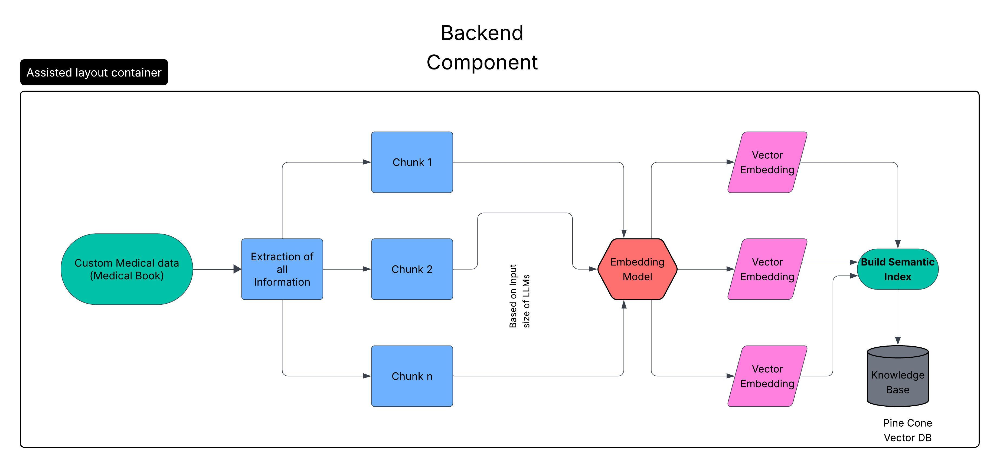
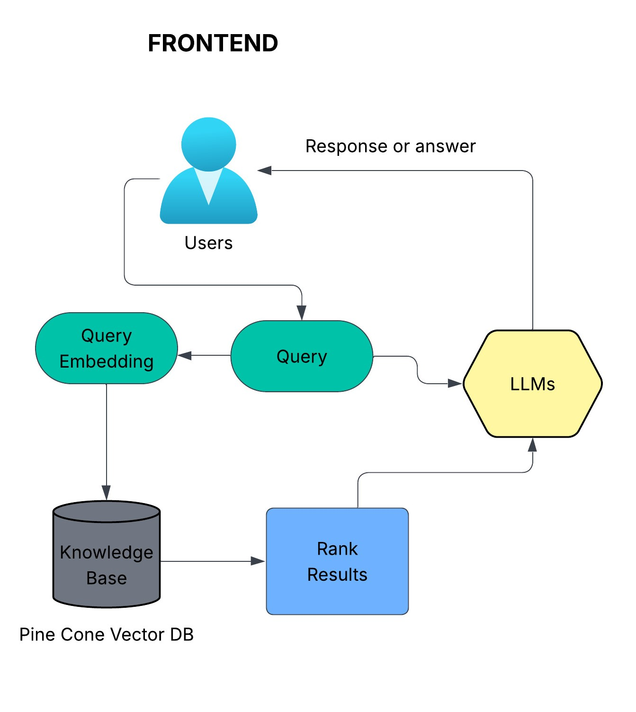
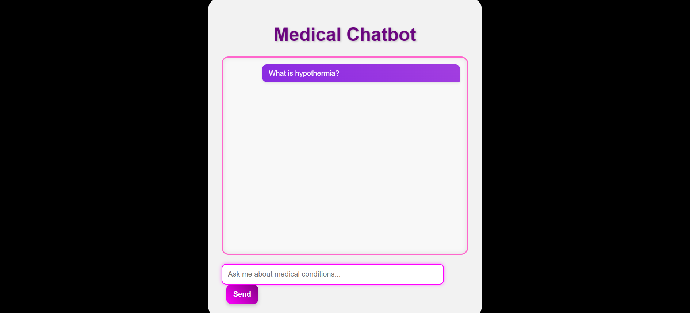
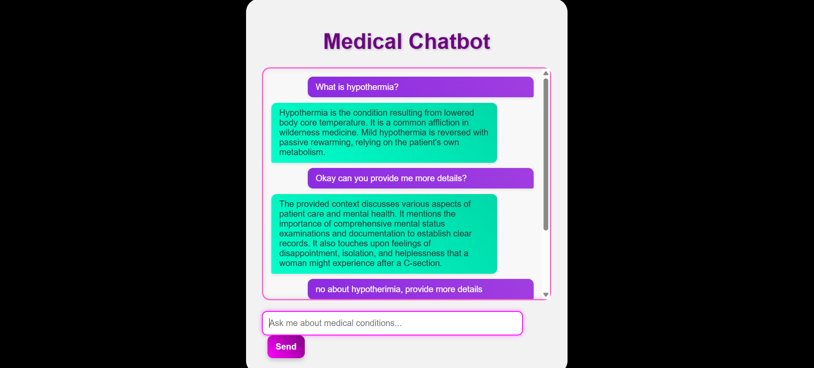

# 🩺 Medical Chatbot with RAG

A Flask-based medical question-answering chatbot leveraging Retrieval-Augmented Generation (RAG) to provide concise, context-aware information on medical conditions, including prevention and medication advice.

---

## Architecture - 




---

## ✨ Features

* **Intelligent Q&A:** Answers medical queries using a Large Language Model (LLM) powered by retrieved context.
* **Retrieval-Augmented Generation (RAG):** Enhances LLM responses by fetching relevant information from a custom knowledge base.
* **Custom Knowledge Base:** Indexes and stores medical data from PDF documents.
* **Vector Database:** Utilizes Pinecone for efficient storage and semantic search of high-dimensional text embeddings.
* **HuggingFace Embeddings:** Employs `sentence-transformers` models (`all-MiniLM-L6-v2`) for generating robust text embeddings.
* **LangChain Integration:** Orchestrates the RAG pipeline, connecting LLM, embeddings, and vector store components.
* **Flexible LLM Backend:** Configured to use **Google Gemma 3n 2B (free)** via the **OpenRouter.ai API gateway**.
* **Web Interface:** User-friendly chat interface built with Flask, HTML, and CSS.

---

## 🚀 Technologies Used

* **Python**
* **Flask:** Web Framework
* **LangChain:** LLM Orchestration Framework
* **HuggingFace Transformers/Sentence-Transformers:** Embeddings
* **Pinecone:** Vector Database
* **OpenRouter.ai:** LLM API Gateway
* **pypdf:** PDF Document Loading
* **python-dotenv:** Environment Variable Management
* **HTML, CSS, JavaScript:** Frontend

---

## 📁 Project Structure

```
Medical_Chatbot/
├── app.py                  # Main Flask application with chatbot logic
├── templates/
│   └── index.html          # HTML for the chat interface
├── static/
│   └── style.css           # CSS for styling the web interface
├── data/                   # Directory to store input PDF documents
│   └── your_medical_docs.pdf
├── src/
│   ├── __init__.py
│   ├── helper.py           # Contains functions for PDF loading, text splitting, embeddings
│   ├── promot.py           # Likely contains the system_prompt definition
│   └── ...
├── .env                    # Environment variables (API keys) - NOT committed to Git!
├── requirements.txt        # Python package dependencies
├── store_index.py          # Script to process data and populate Pinecone index
├── setup.py                # Python package setup file
├── README.md               # This file
└── ... (other project files)
```
---

### Knowledge Base Source

The chatbot's medical knowledge base is derived from **The Gale Encyclopedia of Medicine, 3rd Edition**. The PDF version of this encyclopedia was used to extract information, which was then processed and indexed into the Pinecone vector database.

---

## 🛠️ Setup and Installation

Follow these steps to get your Medical Chatbot up and running on your local machine.

### 1. Clone the Repository

First, clone the project repository to your local machine:

```bash
git clone [https://github.com/Anugrah0619/Medical_Chatbot.git](https://github.com/Anugrah0619/Medical_Chatbot.git)
cd Medical_Chatbot
```

---

## 2. Create and Activate Conda Environment

It's highly recommended to use a Conda virtual environment to manage dependencies:

```bash
conda create -n medbot python=3.10 -y
conda activate medbot
```

---

## 3. Install Required Libraries

Install all necessary Python packages using `pip`:

```bash
pip install -r requirements.txt
```

---

## 4. Configure API Keys

Create a `.env` file in the root directory of your project (`Medical_Chatbot/`). This file will securely store your API keys.

Add your API keys to the `.env` file like this:

```env
PINECONE_API_KEY="your_pinecone_api_key_here"
OPENROUTER_API_KEY="your_openrouter_api_key_here"
```

> 🔒 **Do not share your `.env` file publicly.**

---

## 5. Prepare Medical Data (PDFs)

Place your medical PDF documents in a folder named `data/` inside the root directory:

```
Medical_Chatbot/
├── data/
│   ├── example1.pdf
│   ├── example2.pdf
```

---

## 6. Initialize and Populate Pinecone Index

This step processes your PDF data, generates embeddings, and uploads them to your Pinecone vector database. Run this once to set up your knowledge base.

```bash
python store_index.py
```

This script will:
- Initialize the Pinecone client
- Create the `medicalbot` index if it doesn’t exist (`dimension=384`, `metric=cosine`)
- Chunk and embed PDFs using `all-MiniLM-L6-v2`
- Upload embeddings to Pinecone

---

## 7. Run the Flask Web Application

Once the Pinecone index is populated, you can launch the chatbot:

```bash
python app.py
```

---

## 8. Access the Chatbot

After starting the Flask app, open your browser and visit:

```
http://127.0.0.1:5000/
```

You’ll see the chatbot interface where you can ask questions related to the uploaded medical PDFs.

---

# 🩺 Medical Chatbot: Live Demo & Output

This section showcases the live output and user interface of the Medical Chatbot, demonstrating its ability to provide concise, context-aware answers on medical conditions.

---

## ✨ Key Functionality in Action

The chatbot leverages a **Retrieval-Augmented Generation (RAG)** pipeline to deliver accurate responses. When a user asks a question, the system:
1.  Retrieves relevant information from its indexed knowledge base (The Gale Encyclopedia of Medicine, 3rd Edition).
2.  Feeds this context along with the user's query to a **Google Gemma 3n 2B LLM (via OpenRouter.ai)**.
3.  Generates a concise answer, formatted with clear sections for **Description**, **Prevention**, and **Medications**, as instructed by the system prompt.

---

## 🖥️ Chatbot Interface

The chatbot features a clean, user-friendly web interface built with Flask, HTML, and CSS. The design incorporates vibrant colors for user and AI messages against a sleek black background.

## 💬 Sample Interaction (Visual)

Below is a visual representation of a sample interaction, showing a question asked and the chatbot's structured response.



*Figure: A sample question and the chatbot's structured response, demonstrating RAG in action.*

---

## 🎨 Customize the User Interface

The chatbot's user interface is built using standard HTML, CSS, and JavaScript. You can easily customize its appearance and layout:

* **HTML Structure:** Modify `templates/index.html` to change the layout of the chat elements.
* **CSS Styling:** Edit `static/style.css` to adjust colors, fonts, spacing, and animations. Feel free to experiment with new color schemes, gradients, and visual effects to match your preferences!

---

## 🚀 Technologies Powering the Chatbot (Brief)

* **Python (Flask)**
* **LangChain**
* **HuggingFace Embeddings**
* **Pinecone**
* **OpenRouter.ai (Google Gemma 3n 2B)**

---
